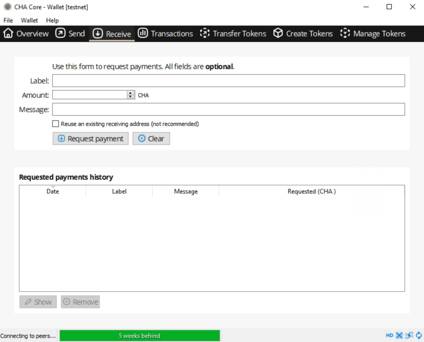
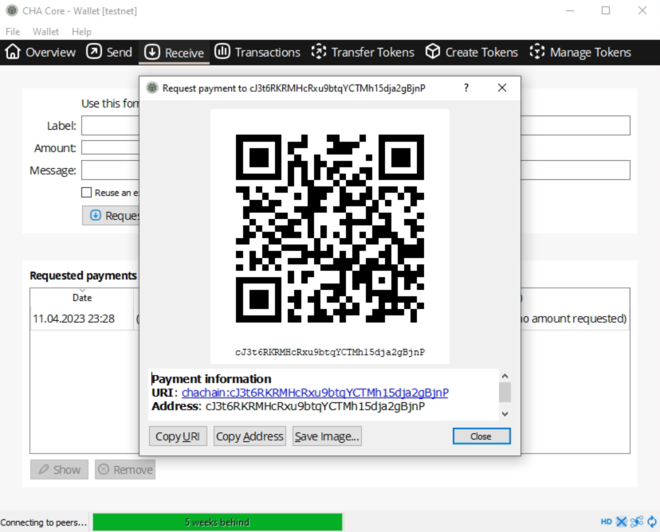
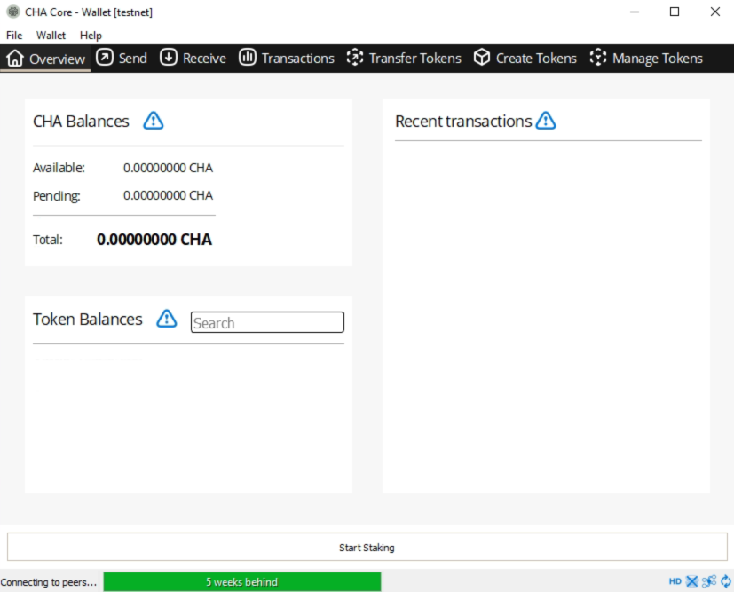

# Staking

Chavinci utilises Proof-of-Stake consensus model which allows user to validate new blocks by holding coins in their full node.

## Full node

You can check [full node](/node) guide for setup instructions and [RPC](/rpc) for available commands to interact with your node.

For staking with full node you must add `staking=1` param to your config file (or launch node with `-staking` flag). Once your node fully synced and running, you can get new address using `getnewaddress` command and send Chavinci to it. After that your node will start validation process and you will be receiving rewards after each validated block.

## Desktop wallet

For staking in desktop wallet first you should go to `Receive` tab and generate deposit address.

After clicking `Request payment` button wallet will generate and display your address.

Once you received coins to your wallet, you can go to `Overview` page and click `Start staking`. Once coins you sent to wallet reach their maturity (60 blocks) wallet will start validation process and you will be receiving rewards after each validated block.

