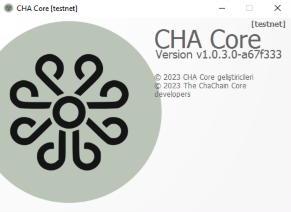
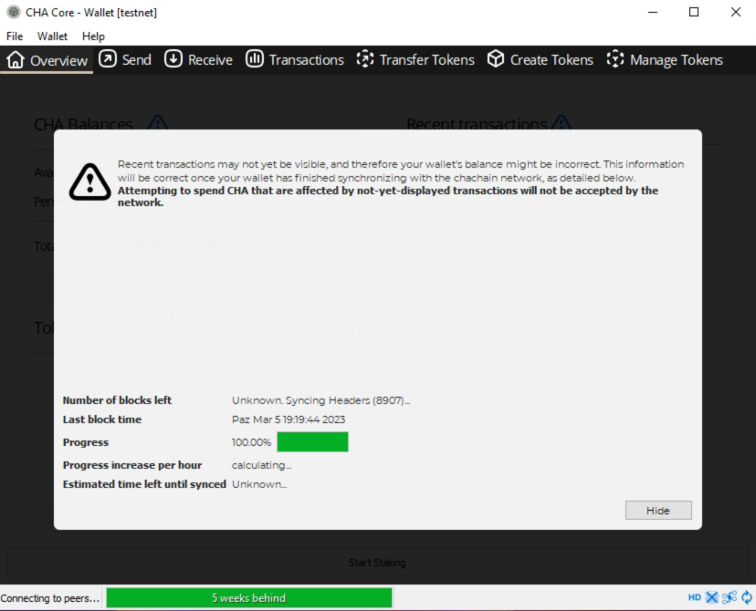
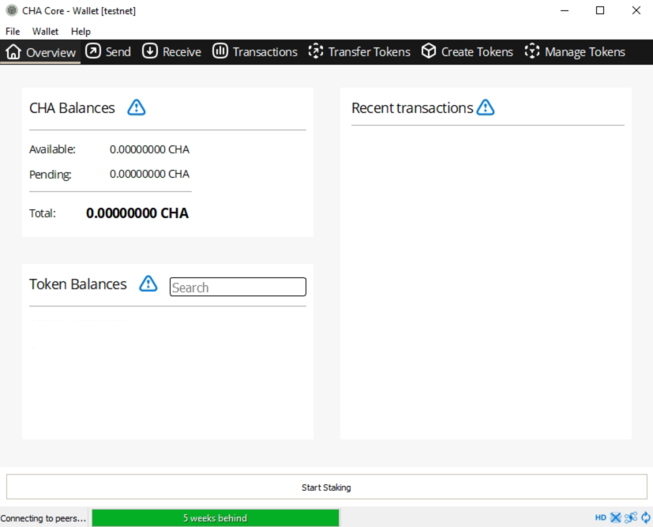
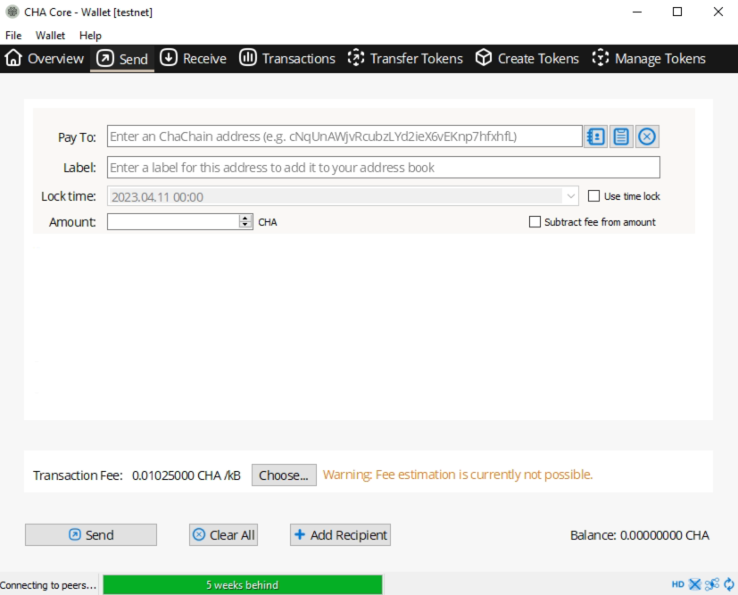
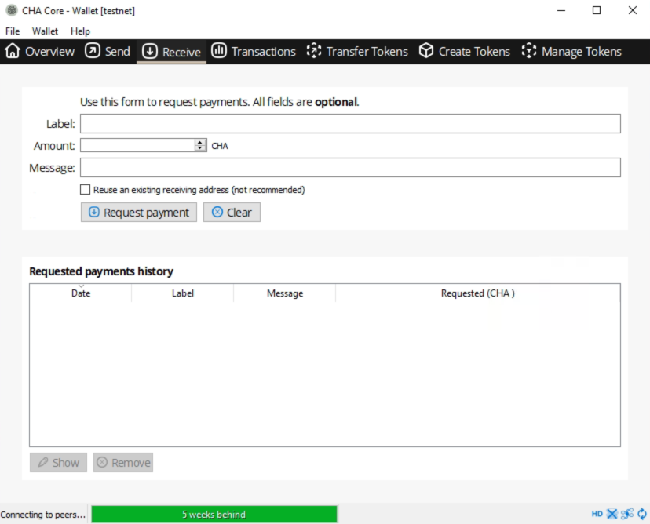
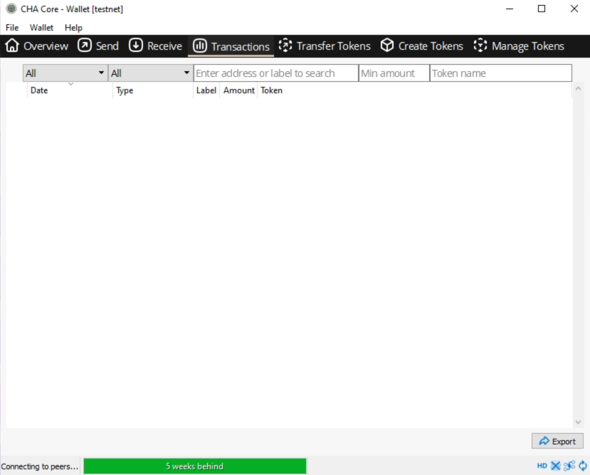
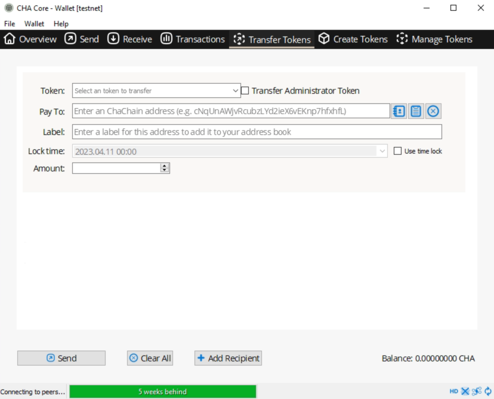
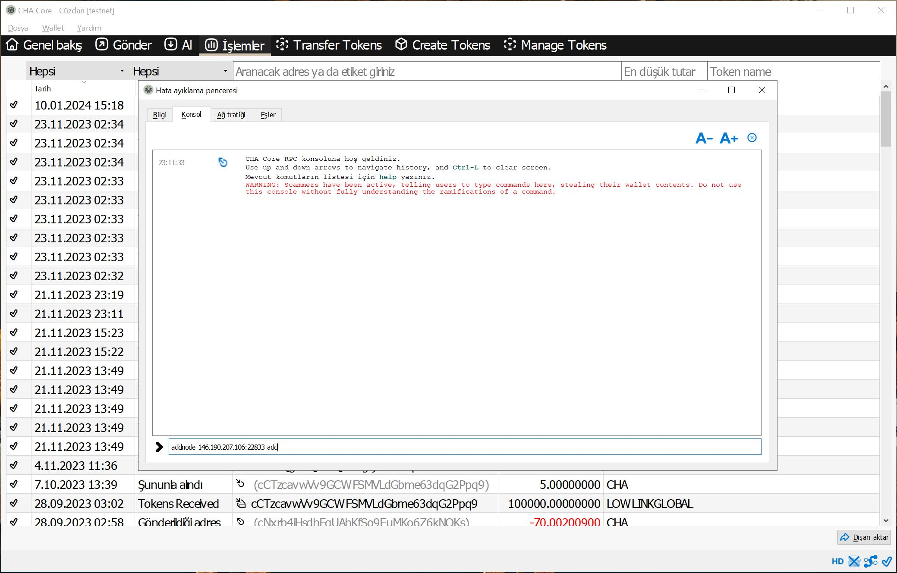

# Cha Core wallet

You can get latest desktop wallet from [here](https://github.com/chavinci-chain/chavinci-releases/releases) or build it on your own using code from [master](https://github.com/chavinci-chain/chavinci-releases/tree/master) branch. Chavinci QT wallet runs on all operating systems: Linux, Mac OS and Windows.

First thing you will see after opening wallet is splash screen:



During first run wallet must synchronize Chavinci blockchain, it may take 5-10 minutes:



Once synchronization is done, you will be presented with overview screen where your Chavinci, tokens and history will be displayed:



You can send your Chavinci coins via send screen:



New address can be created at receive screen:



At transactions screen you can check your history of transfers:



Tokens can be transfered at token transfer screen:




<br/>
You can add yourself as a node from the wallet:
```
addnode 146.190.207.106:22833 add
```

