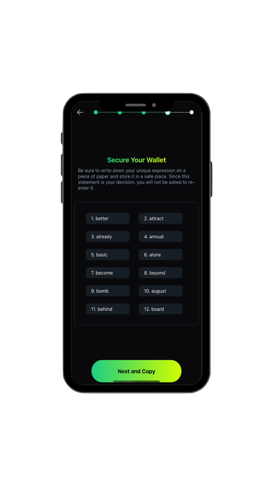
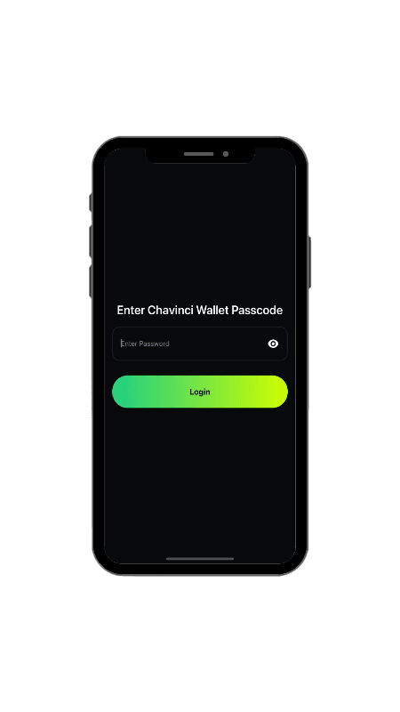
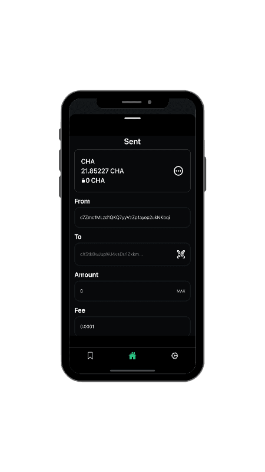
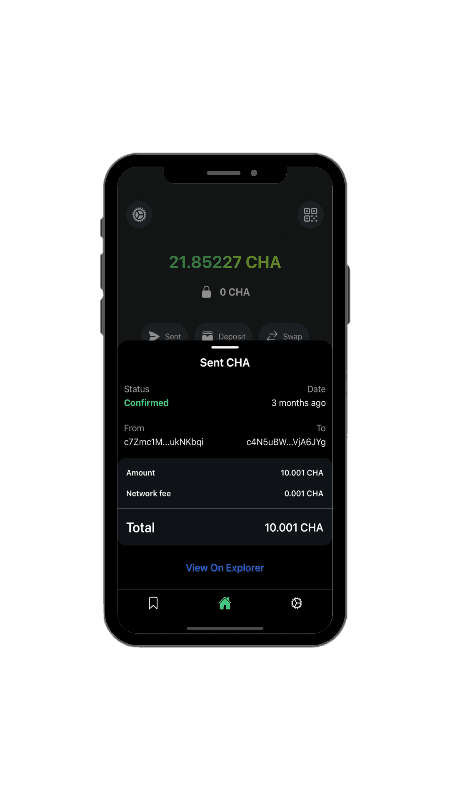
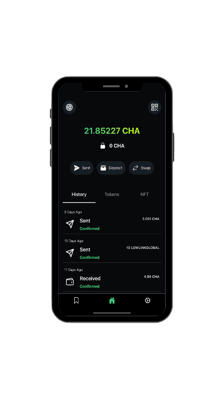
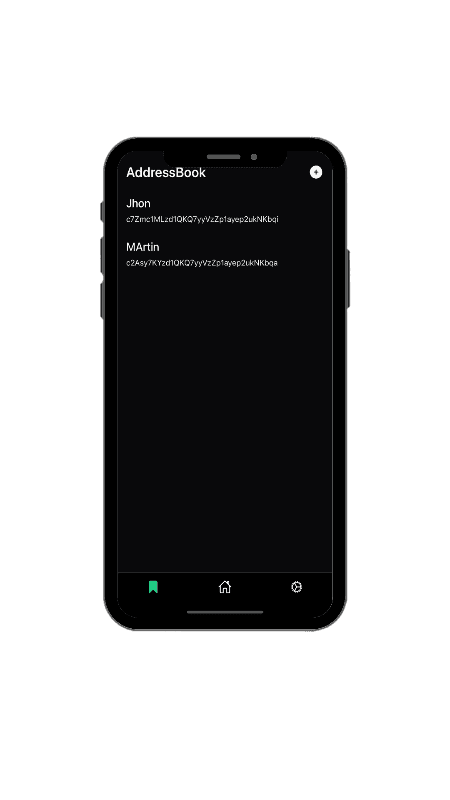

# Mobile wallet

You can get latest mobile wallet from [here](https://chavinci.com/download).

During first run of mobile wallet, you'll need to create or import a wallet using seed phrase:

Once it's done, you will see password screen, select your password carefully:

You can send your Chavinci coins via send screen:

New address can be created at receive screen:

At transactions screen you can check your history of transfers:

In the end, do not forget, to use our address list feature, add important address into that list, and you'll have the option to send fund to them instantly:

